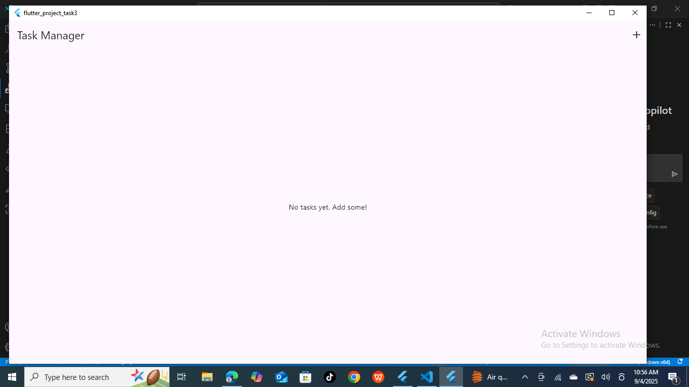

# Task Management App

## 📌 Overview
A simple Flutter app to manage daily tasks with:
- Add, delete, and mark tasks as complete  
- Data persistence using SharedPreferences  
- Custom app bar with add button  
- Simple UI with Flutter Icons  

## ✨ Features
- Home screen displaying a list of tasks  
- Custom AppBar with a title and add button  
- Data persistence so tasks remain after reopening the app  
- Clean UI for better user experience  

## 🚀 Setup Instructions
Follow these steps to run the project on your local machine:

1. **Clone this repository:**
   ```bash
   git clone https://github.com/dilshan141080/flutter_project_task3.git
## 📷 Screenshots


